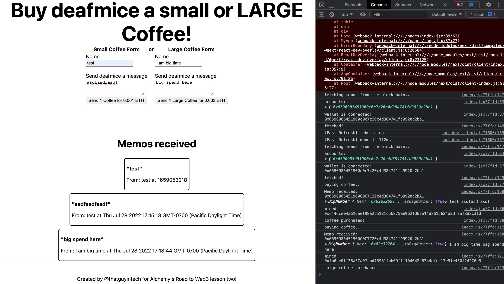
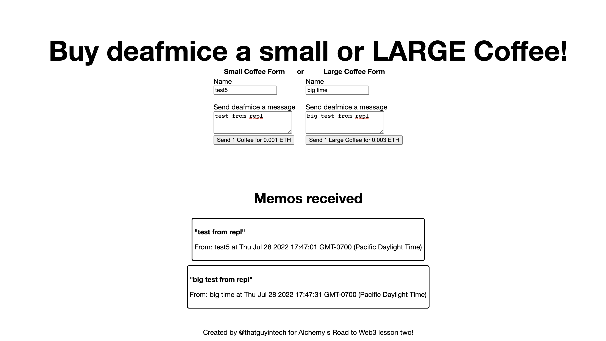
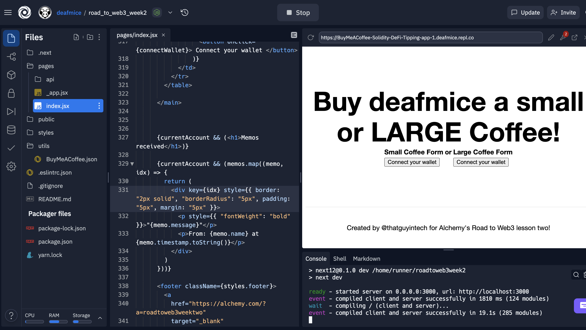

# road_to_web3_week2

## Week 2 How to Build "Buy Me a Coffee" DeFi dapp

- [x] Use the Hardhat development environment to build, test, and deploy our smart contract.
- [x] Connect your MetaMask wallet to the Goerli test network using an Alchemy rpc endpoint.
- [x] Get free Goerli ETH from goerlifaucet.com.
- [x] Use Ethers.js to interact with your deployed smart contract.
- [x] Build a frontend website for your decentralized application with Replit.

### See Backend for the contract

### See Frontend for the webs

https://buymeacoffee-solidity-defi-tipping-app-1.deafmice.repl.co/

### Screenshots

